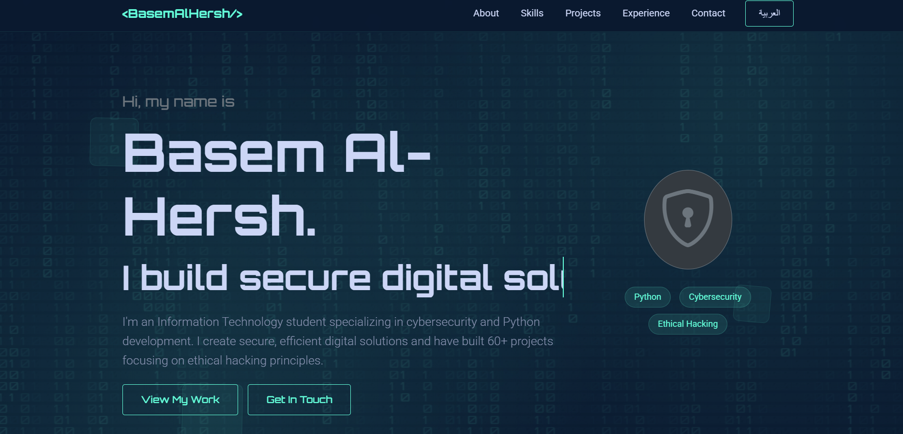

# 🧠 Basem Al-Hersh | Cybersecurity Specialist & Python Developer 🔐  




---

## 🌐 View Demo

**Live Demo:** [View Portfolio](https://cybersecurity-portfoli.vercel.app/)

---
This project reflects not only my technical skills but also my **design philosophy** — *clarity, motion, and depth*.  

---

## 🎯 Key Features  
✨ **Dual Language Support (EN / AR)** — dynamic text switching with full RTL support 🇬🇧🇸🇦  
💻 **Matrix background animation** using Canvas API  
⚙️ **Counters**, **scroll animations**, and **smooth transitions**  
📱 **Fully responsive design** (Bootstrap 5 + media queries)  
🧩 **Dark cyber theme** with neon accents  
🧠 **Interactive navigation** with smart scroll  
🎓 **Education, Certifications, and Experience** sections  
🛠️ **Showcase of 60+ projects and mini tools**  

---

## 🧰 Technologies Used  
- **HTML5** 🌐  
- **CSS3 / Bootstrap 5** 🎨  
- **JavaScript (Matrix, Counters, Language Switch)** ⚙️  
- **Responsive Design & RTL Layout** 📱  
- **Google Fonts (Orbitron, Roboto)** ✍️  

---

## 🚀 How to Run Locally  

1. **Clone this repository:**  
   ```bash
   git clone https://github.com/Basem0AlHersh123/Cybersecurity-Portfolio.git````

2. **Open the folder:**

   ```bash
   cd Cybersecurity-Portfolio
   ```

3. **Launch the website:**
   Simply open the file `index.html` in your browser 🌐

---

## 🧩 Project Structure

```
Cybersecurity-Portfolio/
│
├── index.html          # Main HTML file  
├── style.css           # Styles and cyber animations  
├── script.js           # Matrix animation, counters, language switch  
├── /style/css/         # Bootstrap and icon dependencies  
├── /style/js/          # JS libraries  
└── screenshot.png      # Preview image for GitHub  
```

---

## 📸 Screenshot

Here’s how it looks 👇


---
## View A demo
**View**: [ View ]([(https://cybersecurity-portfoli.vercel.app/)])

## 💼 Sections Included

* 🧑‍💻 **About Me** — background, certifications, and contact info
* 🧠 **Skills** — programming, cybersecurity, OS, and soft skills
* 🚀 **Projects** — Flask app, firewall tool, scraper, and more
* 🏫 **Experience** — English teaching and tutoring background
* ☎️ **Contact** — links, email, Telegram, WhatsApp, and GitHub

---

## 👨‍🎨 Author

**Basem Mohammed Ali Al-Hersh**

> 💬 *"Securing the digital world, one line of code at a time."*

📧 **Email:** [alhrshbasm4@gmail.com](mailto:alhrshbasm4@gmail.com)
🔗 **GitHub:** [Basem0AlHersh123](https://github.com/Basem0AlHersh123)
💬 **Telegram:** [@Basem0AlHersh](https://t.me/Basem0AlHersh)
📺 **Channel:** [Cyber_Sentinel0](https://t.me/Cyber_Sentinel0)
📘 **LinkedIn:** [Basem Al-Hersh](https://www.linkedin.com/in/basem-alhersh-769179397)

---

## 💖 Support & Feedback

If you enjoyed this project:
⭐ Give it a **Star** on GitHub — it helps a lot!
💬 Connect with me for collaborations or cybersecurity discussions.
🚀 Share this portfolio with other developers and learners!

---

### 🧠 Built with passion, secured with precision — by Basem Al-Hersh 🛡️

```
